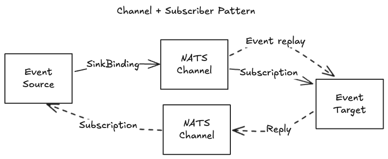

# EventHub
CZ EventHub

## Desgin Principals

* **Event mesh**. The system is capable to route events from producers to consumers in hybrid cloud environemts.
* **Streaming**. The system is capable to stream events from producers to consumers. That means it is capable of replaying events not only queueing them.
* **Event bridging**. The system is capable to bridge events from different sources to different targets, also transforming them. Furthermore, this should use a declarative approach.
* **Scalability**. The system is capable to scale horizontally and vertically.
* **Resilience**. The system is capable to recover from failures.
* **Security**. The system is capable to secure the communication between producers and consumers.
* **Open standards**. The system is based on open standards like [NATS.io](https://nats.io/) and [Knative Eventing](https://knative.dev/docs/eventing/).

## Design Patterns

## Installation
Either on local kubernetes with kind or cloud-based like AKS

/IaC folder conatins azure resources \
/scripts/setup.sh can be used to install knative and nats channel support